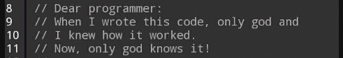

<!--  -->
<!--   -->
<!--

  

### Hello fellow 👋

## About me

- 😄 In the process to finish somehow and somewhere my Ph.D.
- 👯 I’m looking to collaborate on basically anything, I am really curious, especially in topics related to robotics.
- Professional Experience in 5 countries (Mexico, Germany, Norway, Chile, and United Kingdom)

**jcmayoral/jcmayoral** is a ✨ _special_ ✨ repository because its `README.md` (this file) appears on your GitHub profile.
Here are some ideas to get you started:
- 🔭 I’m currently working on ...
- 🌱 I’m currently learning ...
- 👯 I’m looking to collaborate on ...
- 🤔 I’m looking for help with ...
- 💬 Ask me about ...
- 📫 How to reach me: ...
- 😄 Pronouns: ...
- ⚡ Fun fact: ...
-->

Connect with me:

[][twitter]
[][linkedin]
[][instagram]
[][wordpress]

<!-- Template taken from STACKr video on https://www.youtube.com/watch?v=ECuqb5Tv9qI -->
<!--[][website]
[][youtube] -->

<!--

  

    <a href="https://github.com/jcmayoral/github-readme-stats">
      
  

-->
  

    <a href="https://github.com/jcmayoral/github-readme-stats">
      
 

     
[twitter]: https://twitter.com/elbuenmayito
[instagram]: https://instagram.com/josesito.no
[linkedin]: https://www.linkedin.com/in/jcmayoral/
[wordpress]: https://roboticaymas.wordpress.com
